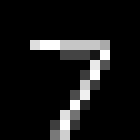
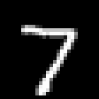
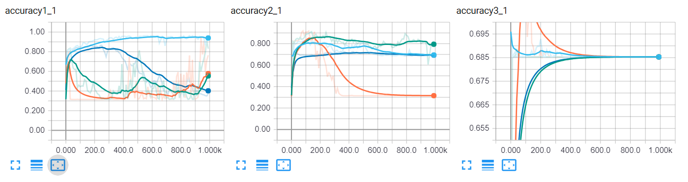
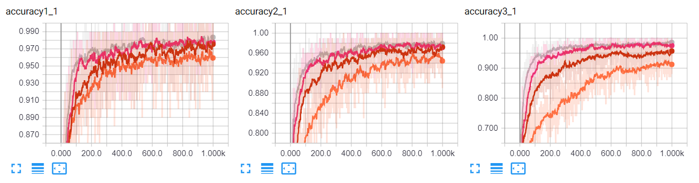
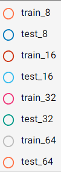

# mnist_cnn_test
2 Class MNIST Classification Using CNN

# Goal
Using CNN to classify the MNIST dataset for two classes: the input digit image >= 3 or < 3. Thus it's a two class classification problem.

# Input Images

## Downsampling
The input samples first downsampled to 14x14 (from 28x28) using tf.image.resize function.

## Blurring
Then, a blurring filter applied to all the input samples. The blurring filter is (1/9) * np.ones(3,3)

# Architecture
A big picture of architecture for three models (1, 2, 3 CNN layers) is in img directory.

# Number of CNN Layers Experiment
In this experiment, I changed the number of CNN layers from 1 to 3.
Every CNN layer is followed by a ReLU activation function and Batch Normalization operation. 
The model continues with a fully connected layer, a dropout layer, and a signle fully connected layer with 2 units to predict the two classes.

Test and Train accuracy for different number of filter (N) and different number of layers (left: 1, middle: 2, right: 3):
### Test Accuracy

### Train Accuracy

Legend for different number of filter on each CNN layer (Train/Test):

# Conclusion
All the models have a reasonable train accuracy. However, 

# Parameters
* Learning rate: 0.001
* Batch size: 100
* Number of Train examples: 
* Number of Test examples:
* Keep_prob for dropout layer: 
* Kernel size for conv2d layer: (3,3)
* strides: (2,2)

## Prerequisites
* Python 3.5
* Tensorflow 1.4.1

